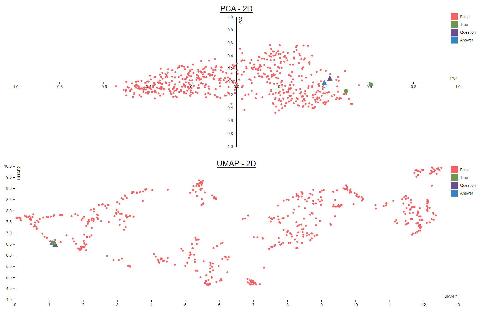

<h1>About</h1>

- This is a small d3.js visualization project that aims to show the difference between dimensionality reduction algorithms PCA and UMAP, and which is more suitable for word embeddings. These algorithms were solely employed for  visualization purposes. Documents of text come from Retrieval Augmented Generation workflow, and the embedded question and answer are the ones given to the LLM. Documents which contain the right answer are colored green while the rest are colored orange. Purple triangle represents the question and the blue triangle represents the actual answer.

<h1>How to run</h1>

- Run index.html with live server

